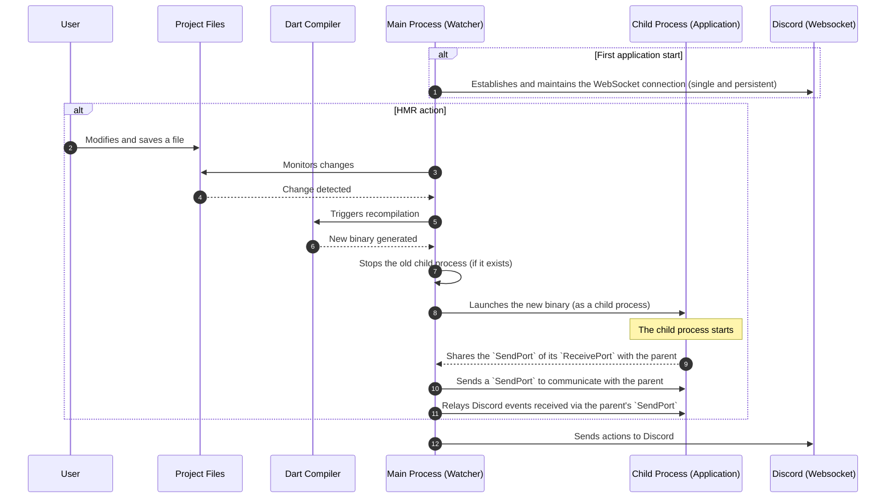

HMR (Hot Module Replacement) is a very popular feature in the Node universe used to reload only the modified business code without refreshing an entire web page.

It is commonly used in development environments to speed up iterations.

> [!important]
> A section detailing the use of HMR is available [here](/docs/api/hmr).

---

## From the world of the web

The bundler created by [Antfu](https://github.com/antfu) needs no introduction. [Vite.js](https://vite.dev) has quickly become an extremely popular replacement for Webpack in all frontend web applications.

Extremely fast, responsive and efficient, Vite.js offers a smooth and enjoyable development experience by instantly reloading your web pages whenever you save your code.

Vite.js relies on communication between a development server and the browser.

1. **Initialisation:** When the application is launched, a development server is set up to monitor all files. It also injects a small script into your application's client, allowing it to open a WebSocket connection to communicate with the server in real time.

2. **Change detection:** When you modify and save a file, the development server detects it immediately.

3. **Impact analysis:** The server analyses a ‘dependency graph’ to determine which modules are affected by the change. The strength of Vite.js is that it relies on the browser's native ES modules (ESM), which make this analysis extremely fast. Only the altered part will be rebuilt within the bundle.

4. **Sending the update:** The server sends the new code for the modified module(s) to the client via the WebSocket connection.

5. **Hot replacement:** The client-side HMR script receives these new instructions. It is able to replace the old module code with the new code directly in the browser's memory, without having to reload the page. For frameworks such as React or Vue, HMR goes even further by attempting to update only the relevant component while preserving its state (for example, the text you entered in a form).

This process provides almost instant feedback on changes, which drastically speeds up the development cycle.

---

## Initial observations

Vite.js is an incredible tool in terms of both its design and its application, but we cannot follow its implementation scheme due to the context of Mineral. Although our "interface" is represented by the Discord application itself, we cannot (and should not) reload the Discord client, as this would be pointless.

However, we must take into account the fact that Mineral is a framework providing a multitude of tools **within a backend context only**. This implication requires a **different approach** to enable the efficient use of HMR.

Let us start from the assumption that the application developer adds a `print` to the `main.dart` file.

:::code-group labels=[main.dart]

```dart
Future<void> main() async {
  // [!code ++]
  print('Hello World !');

  final client = ClientBuilder()
    .build();

  client.events.ready((bot) {
    client.logger.info('Bot is ready as ${bot.username}!');
  });

  await client.init();
}
```

:::

When saving the file, we expect to see the text `Hello World!` in the console.

To do this, we must take several implications into account:

- Unlike JavaScript, the Dart language cannot import dynamically during runtime.
- Dart must be compiled (exe, jit, aot, or kernel) before it can be executed.
- Compilation generates a "finished" file that must be written to the machine.

> [!important]
> HMR can be used in any Dart or Flutter project, and the package is available on [Dart Pub](https://pub.dev/packages/hmr).

---

## Process

First, we need to create and maintain a process that is constantly "alive" so that we can listen for changes to your project files.

To achieve this, a main process is launched and is responsible for monitoring changes to all of your project files.

When a change is saved, this process intercepts the event and immediately triggers the recompilation of the application into a new binary. Once the binary is ready, the main process executes it as a child process.

In order to enable communication between the parent process (the watcher) and the child (your application), a communication channel must be established. The solution is for the child process to create and share its `ReceivePort` communication port with the parent.

Therefore, the application's `main` function must be adapted to handle the reception and initialisation of this port.

:::code-group labels=[main.dart]

```dart
// [!code --]
Future<void> main() async {
// [!code ++]
Future<void> main(_, port) async {
  print('Hello World !');

  final client = ClientBuilder()
    // [!code ++]
    .setHmrDevPort(port)
    .build();

  client.events.ready((bot) {
    client.logger.info('Bot is ready as ${bot.username}!');
  });

  await client.init();
}
```

:::

This process allows you to monitor changes to your project files and trigger the recompilation of the application into a new binary as soon as a change is detected.

---

## Discord imposes constraints

In its [official documentation](https://discord.com/developers/docs/events/gateway#identifying), Discord informs us of a notable limitation of 1000 connection per 24 hours attempts per day to their Websocket service.

This information is very important and adds significant weight to the attention we must pay to our implementation.
When we restart our application, we make a connection attempt which, combined with the large number of restarts, can exceed the limits imposed by Discord.

To this end, we need to exclude connection attempts to the Websocket service during each restart in order to keep only one attempt, that of the initial start of the application.



Offloading event listening from the websocket channel significantly reduces the number of connections established with Discord, which is essential for circumventing the limitations imposed by Discord when using the Websocket API.

> [!warning]
> It is important to note that [slash commands](/docs/api/commands) are only updated when the parent process is started.
