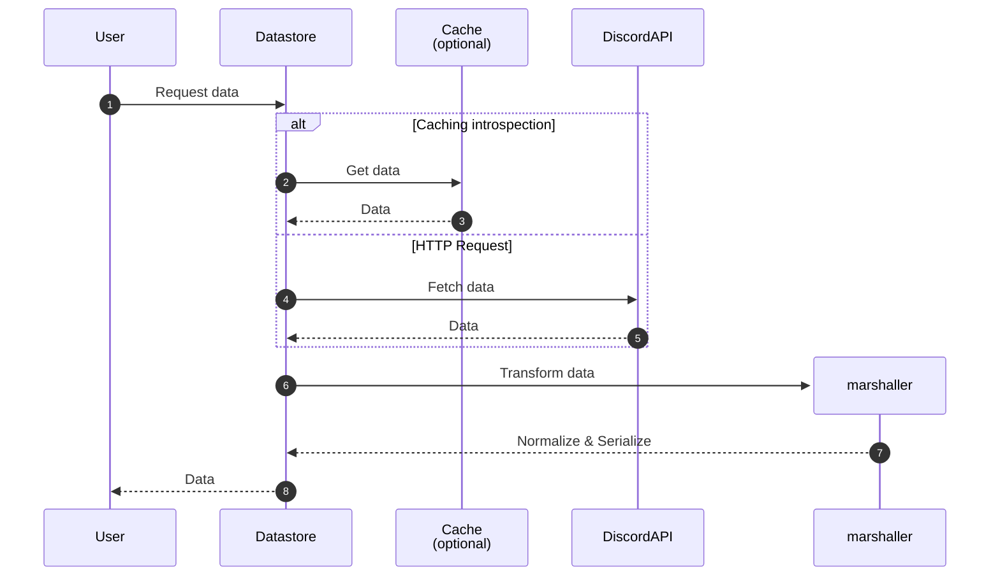

# Datastore

It plays an abstraction role in data retrieval, enabling centralised access to different sources such as caching solutions or external APIs such as Discord.

---

## Introduction

Le datastore est une brique logicielle indispensable pour interagir avec le monde hors de notre application.
Dans notre cas nous l'utilisons afin d'effectuer des requêtes HTTP vers l'API HTTP de Discord, de plus il nous permet de travailler et d'abstraire 3 axes primordiaux :

- Abstraction de la source de données (caching, rest…)
- Requêtes auprès de l'API HTTP de Discord
- Sérialization des données bruts vers des classes

---

## Fonctionnement

Le datastore est utilisé à chaque fois que vous tentez d'accéder à une donnée non distribuée directement par un évènement ou que vous essayez d'effectuer une action vers l'API HTTP de Discord.
Le schéma ci-dessous illustre le processus d'accès aux données via le datastore.

### Caching

Lorsqu'un utilisateur fait une requête de données au datastore, celui-ci commence par vérifier si les données sont disponibles dans le cache. Si les données sont présentes, elles sont récupérées directement depuis le cache et renvoyées au datastore.

### Discord API

Dans le cas contraire, le datastore effectue une requête vers l'API HTTP Discord pour obtenir les données nécessaires. Une fois les données récupérées, le datastore fait appel à la brique `Marshaller` qui a pour rôle de transformer, normaliser et sérialiser les données brutes en objets ou classes utilisables par l'application.

> [!note]
> Le `Marshaller` permet d'effectuer une scission propre de notre dépendance avec le monde extérieur.

Les données transformées sont renvoyées à l'utilisateur.



## Usage

Lorsque vous utilisez une méthode devant effectuer une récupération de données,

### Event flow

Vous pouvez utiliser le service `rest` directement depuis le client Mineral ou en récupérant le service `Datastore` depuis l'`IoC`.

:::code-group labels=[message_create.dart]

```dart
Future<void> main() async {
  final client = ClientBuilder()
    .setCache(MemoryProvider.new)
    .build();

  client.events.server.createMessage((message) async {
    final builder = MessageComponentBuilder()
      ..text('Hello World ! 🚀');

    // [!code highlight]
    await message.reply(builder);
  });

  await client.init();
}
```

:::

### Explicit rest flow

Il peut arriver que vous soyez amené à récupérer des données en dehors d'une réaction à un évènement.
Vous pouvez utiliser le service `rest` directement depuis le client Mineral ou en récupérant le service `Datastore` depuis l'`IoC`.

:::code-group labels=[main.dart, function.dart]

```dart
Future<void> main() async {
  final client = ClientBuilder()
    .setCache(MemoryProvider.new)
    .build();

  final serverId = '583050048766476353';
  final channels = await client.rest.channel.fetch(serverId); // [!code highlight]

  print(channels); // Map<Snowflake, Channel>

  await client.init();
}
```

```dart
Future<void> fn() async {
  final datastore = ioc.resolve<DataStoreContract>();

  final serverId = '583050048766476353';
  final channels = await datastore.channel.fetch(serverId);

  print(channels); // Map<Snowflake, Channel>
}
```

:::
